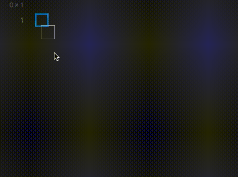
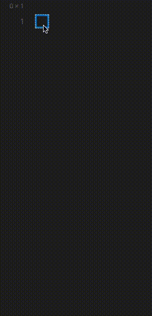
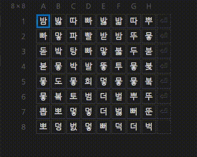
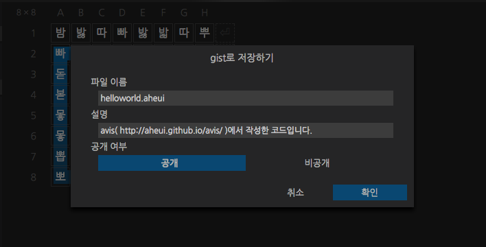

# [AVIS](http://aheui.github.io/avis/)
한글로 쓰는 난해한 프로그래밍 언어 [아희](http://aheui.github.io/introduction.ko)의 코드 편집기이자 실행기입니다.

전통적인 아희 실행기 [jsaheui](http://aheui.github.io/jsaheui/jsaheui_ko.html)의 기능을 전부 포함하며, 다음과 같은 특징을 가지고 있습니다:

- 코드공간이 엑셀처럼 격자식으로 되어있어 세로방향으로 진행하는 코드를 읽기 편합니다.
- 작성한 코드를 저장하고 url로 공유할 수 있습니다.
- 커서가 지나간 자취를 이해하기 쉽게 보여줍니다.
- <del>잘 만들었습니다.</del>

## 지원 브라우저
PC 크롬, 파이어폭스의 최신 안정버전만 지원합니다.

## 미리보기
#### 코드를 중간부터 작성할 수도 있고

#### 세로쓰기가 가능하고

#### 작성중인 코드를 바로 돌려볼 수도 있고

#### 작성한 코드를 gist로 저장해서 다른사람들과 공유할 수 있습니다!

